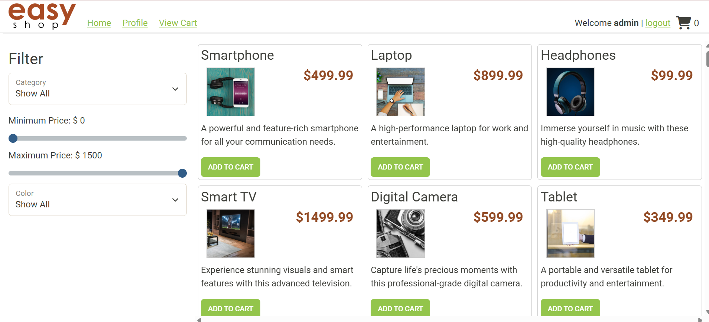
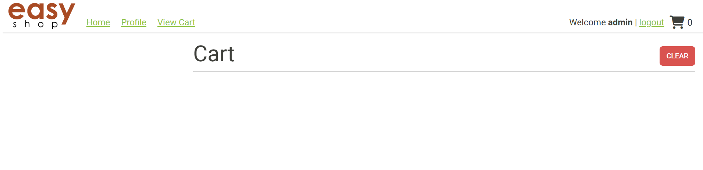

# Easy Shop Shopping Site

Welcome to the Easy Shop Site, a web based shopping store.

### Features
- Browse products
- Search by price range
- Search by color
- Search by category
- View cart

### Prerequisites

- IntelliJ IDEA: Ensure you have IntelliJ IDEA installed, which you can download from [here](https://www.jetbrains.com/idea/download/).
- Java SDK: Make sure Java SDK is installed and configured in IntelliJ.

### Running the Application in IntelliJ

Follow these steps to get your application running within IntelliJ IDEA:

1. Open IntelliJ IDEA.
2. Select "Open" and navigate to the directory where you cloned or downloaded the project.
3. After the project opens, wait for IntelliJ to index the files and set up the project.
4. Find the main class with the `public static void main(String[] args)` method.
5. Right-click on the file and select 'Run 'YourMainClassName.main()'' to start the application.

### Technologies Used

- Java Maven 17

### Demo

Here are pictures from the site 

Here is the home screen of the site

Here is where your cart would be

Here is what a search by color would look like

This is what the filter by category looks like

This is what it would look like if you wanted to search between a price range